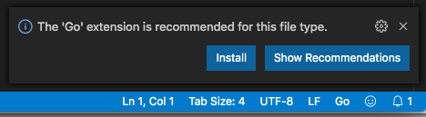
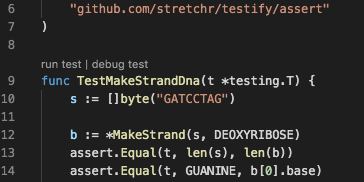
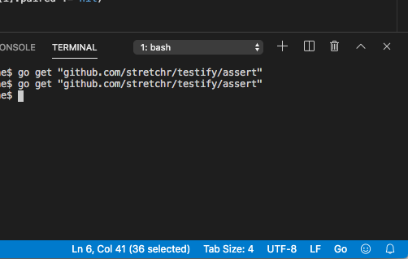
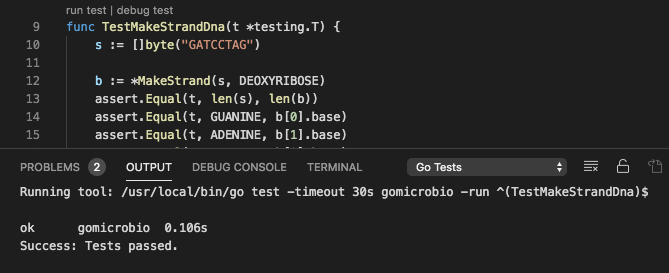

# Setup

## Getting vscode
Download Visual Studio Code from
https://code.visualstudio.com . For MacOS, it will likely just download it to your Downloads folder.  It's best to copy it to the Applications folder.

## Launch vscode

Open the project folder.

## Vscode Extensions

You will see a prompt on bottom right corner explaining that an extension is needed to get go-lang support.  Click install.

You will see more of these to load various go-lang specific functionality, such as outline support.

## Unit Tests
### Running a test
One of the nice things about an IDE like vscode is the convenience of having integration with running or debugging.  If you click the **Explorer** icon on the left button bar and select a file ending in `_test.go` the editor pane will contain the contents of that file.  There will be gray annotations on the top of the file and on top of every test file like **run test | debug test**.  Clicking on the run test will launch a `go test` commandline to run the test and show the output in the bottom pane.

### Loading dependencies

If you click 'run test' you will get an error like:
`cannot find package "github.com/stretchr/testify/assert" in any of:`

This is the test API used.  It has to be downloaded.  The bottom pane of vscode has a menu bar with options like *Problems*, *Output*, *Debug Console*, *Terminal*.  Select terminal and type `go get "github.com/stretchr/testify/assert"`.  It should pause for several seconds while it downloads and installs the code into your go/src/ directory.

### A successful test run

Now if you click on a 'run test' link, the vscode bottom pane switches to *Output* and you can see the command and result.  If your test is successful, it will finish with `Success: test passed.`  Woot!

### Run all tests for file

At the top of a `_test.go` file, vscode will provide gray links for **run package tests | run file tests** .  Likely you will have only one package, so running the package tests will run all your tests, while the file tests are only for the specific test file you have open.
